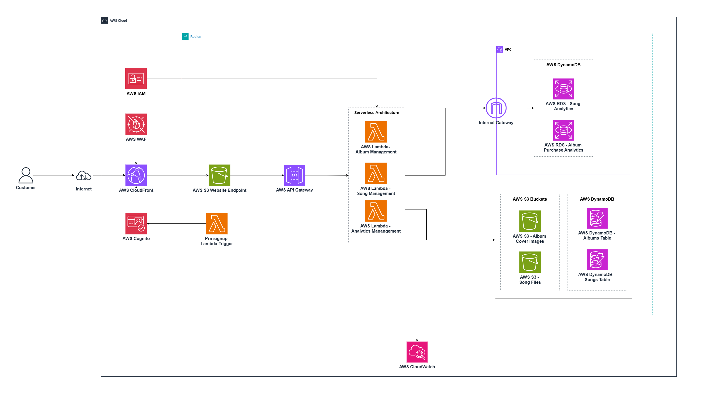

# About the project

DreamStreamer is a AI-driven music streaming service that provides personalized music recommendations based on user preferences. Created for the coursework model 'Enterprise Cloud and Distributed Web Applications'.

# Technology Used
Frontend development HTML, CSS and Javascript for responsive styling Framer Motion for animations AWS Services for backend services

# AWS Solution Design Diagram for DreamStreamer

